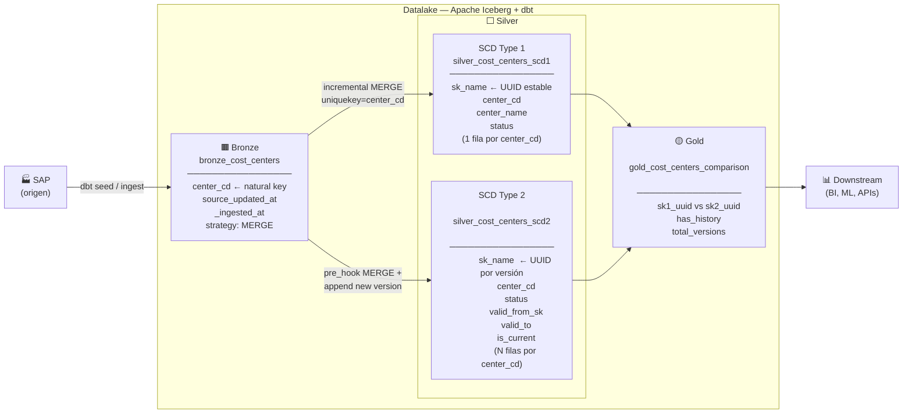
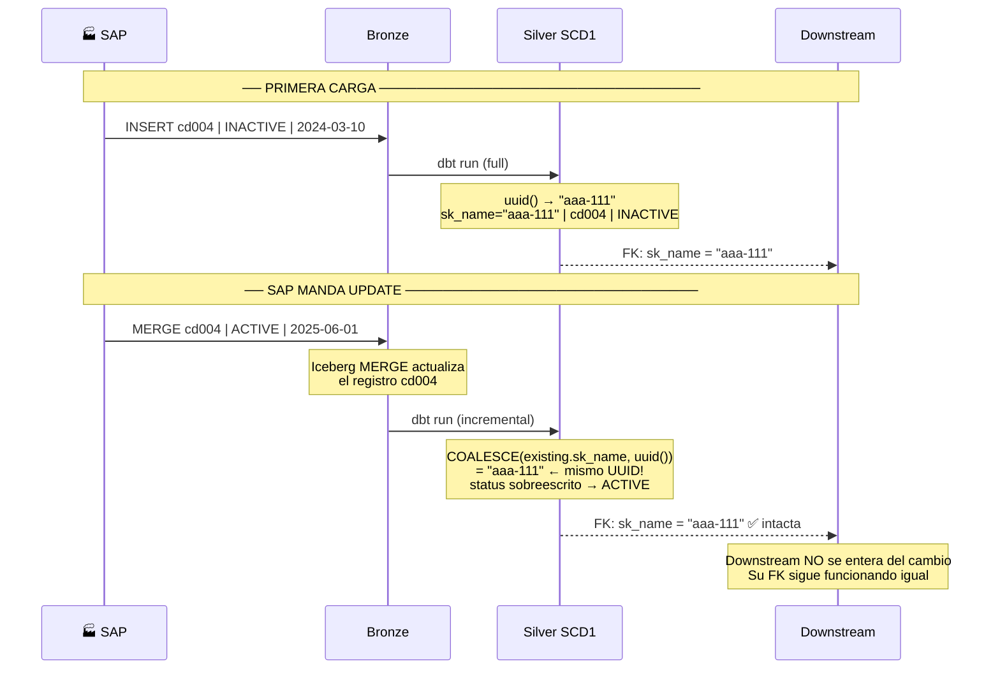
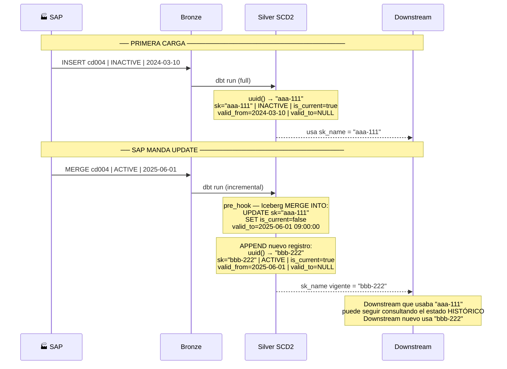
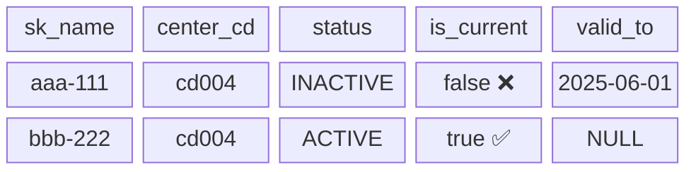
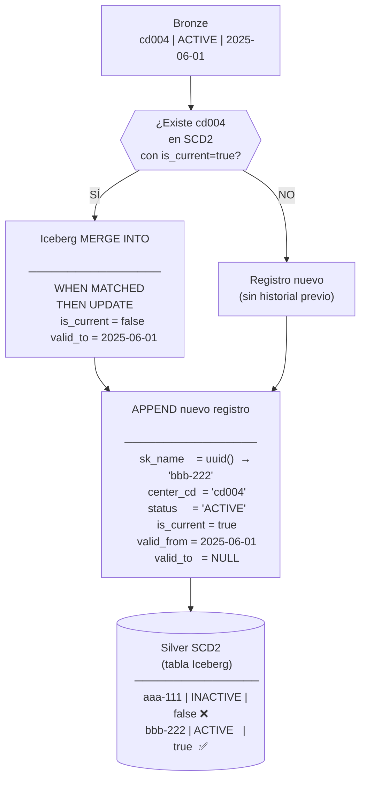
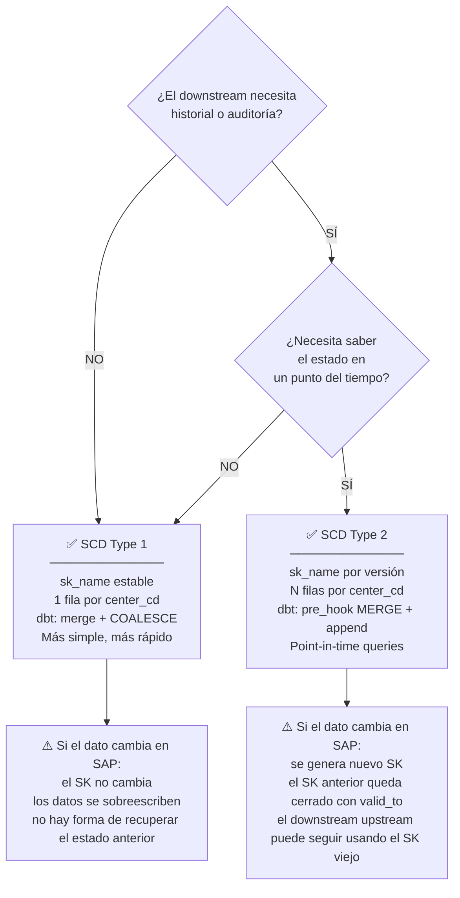

# Ejemplos: SCD1 vs SCD2 con Iceberg + dbt

## Datos de ejemplo

### Origen SAP — estado inicial

```
center_cd | center_name   | status   | updated_at
----------+---------------+----------+--------------------
cd004     | Centro Oeste  | INACTIVE | 2024-03-10 14:00:00
```

### Origen SAP — después del UPDATE

```
center_cd | center_name   | status | updated_at
----------+---------------+--------+--------------------
cd004     | Centro Oeste  | ACTIVE | 2025-06-01 09:00:00
```

---

## Diagramas Mermaid

### 1. Flujo general del pipeline



---

### 2. SCD Type 1 — comportamiento ante un UPDATE



---

### 3. SCD Type 2 — comportamiento ante un UPDATE



---

### 4. Estado de la tabla SCD2 tras el UPDATE



---

### 5. Iceberg MERGE INTO — el mecanismo interno



---

## Código core

### Bronze — `bronze_cost_centers.sql`

El único trabajo de bronze es **MERGE con upsert** sobre la clave natural:
dbt traduce `incremental_strategy = 'merge'` a un `MERGE INTO` de Iceberg.

```sql
-- dbt config → Iceberg MERGE INTO (upsert por center_cd)
{{ config(
    materialized         = 'incremental',
    incremental_strategy = 'merge',
    unique_key           = 'center_cd',      -- ← clave del MERGE
    file_format          = 'iceberg'
) }}

SELECT
    center_cd,
    center_name,
    status,
    CAST(updated_at AS TIMESTAMP) AS source_updated_at,
    current_timestamp()           AS _ingested_at,
    'SAP'                         AS _source_system
FROM {{ ref('sap_cost_centers_raw') }}


-- Watermark: solo registros más nuevos que el último procesado
WHERE CAST(updated_at AS TIMESTAMP) > (
    SELECT COALESCE(MAX(source_updated_at), CAST('1900-01-01' AS TIMESTAMP))
    FROM {{ this }}
)

```

**SQL que genera Iceberg internamente:**

```sql
MERGE INTO local.bronze.bronze_cost_centers AS target
USING (
    SELECT 'cd004' AS center_cd, 'ACTIVE' AS status,
           TIMESTAMP'2025-06-01 09:00:00' AS source_updated_at, ...
) AS source
ON target.center_cd = source.center_cd          -- join por clave natural
WHEN MATCHED THEN UPDATE SET                     -- actualiza si ya existe
    target.status           = source.status,
    target.source_updated_at = source.source_updated_at, ...
WHEN NOT MATCHED THEN INSERT (...)               -- inserta si es nuevo
VALUES (...)
```

---

### Silver SCD1 — el truco del `COALESCE`

El núcleo de SCD1 es esta lógica: **devuelve el UUID existente si el
registro ya existía, o genera uno nuevo si es la primera vez.**

```sql
{{ config(
    materialized         = 'incremental',
    incremental_strategy = 'merge',
    unique_key           = 'center_cd',   -- ← mismo MERGE, un registro por cd
    file_format          = 'iceberg'
) }}

-- En modo incremental: recuperar UUIDs ya asignados

existing_keys AS (
    SELECT center_cd, sk_name FROM {{ this }}
),


-- Solo procesar lo que cambió en bronze
enriched AS (
    SELECT * FROM {{ ref('bronze_cost_centers') }}
    
    WHERE source_updated_at > (SELECT MAX(source_updated_at) FROM {{ this }})
    
)

SELECT
    -- ↓ NÚCLEO DE SCD1: preservar UUID si ya existe, generar si es nuevo
    
    COALESCE(ek.sk_name, uuid()) AS sk_name,
    
    uuid()                        AS sk_name,
    
    e.center_cd,
    e.center_name,
    e.status,
    ...
FROM enriched e

LEFT JOIN existing_keys ek ON e.center_cd = ek.center_cd

```

**Resultado para cd004 antes y después del UPDATE:**

```
-- ANTES del update SAP:
sk_name    | center_cd | status
-----------+-----------+---------
"aaa-111"  | cd004     | INACTIVE

-- DESPUÉS del update SAP (dbt run incremental):
-- COALESCE("aaa-111", uuid()) = "aaa-111"  ← UUID no cambia
sk_name    | center_cd | status
-----------+-----------+---------
"aaa-111"  | cd004     | ACTIVE   ← solo el dato cambió
```

---

### Silver SCD2 — el `pre_hook` + `append`

SCD2 requiere **dos operaciones atómicas**: cerrar la versión vieja
y abrir la nueva. Se implementa con `pre_hook` (Iceberg MERGE) + `append`.

```sql
{{ config(
    materialized         = 'incremental',
    incremental_strategy = 'append',    -- ← solo inserta, nunca actualiza
    file_format          = 'iceberg',

    -- PASO 1: cerrar versiones activas que cambiaron (pre_hook)
    pre_hook = "
        MERGE INTO {{ this }} AS target
        USING (
            -- Detectar: registros que existen en bronze con timestamp más nuevo
            SELECT DISTINCT b.center_cd, b.source_updated_at
            FROM {{ ref('bronze_cost_centers') }} b
            INNER JOIN {{ this }} t
                ON  b.center_cd        = t.center_cd
                AND t.is_current       = true
                AND b.source_updated_at > t.source_updated_at
        ) AS updates
        ON  target.center_cd  = updates.center_cd
        AND target.is_current = true
        WHEN MATCHED THEN UPDATE SET
            target.is_current = false,                       -- ← cerrar versión
            target.valid_to   = updates.source_updated_at   -- ← sellar timestamp
    "
) }}

-- PASO 2: insertar nueva versión con nuevo UUID (append)
WITH changed_records AS (
    SELECT b.*
    FROM {{ ref('bronze_cost_centers') }} b
    LEFT JOIN {{ this }} t
        ON  b.center_cd = t.center_cd AND t.is_current = true
    WHERE t.center_cd IS NULL                      -- nuevo en datalake
       OR b.source_updated_at > t.source_updated_at -- cambió en SAP
)

SELECT
    uuid()                  AS sk_name,        -- ← NUEVO UUID por versión
    center_cd,
    center_name,
    status,
    source_updated_at       AS valid_from_sk,  -- inicio de vigencia
    CAST(NULL AS TIMESTAMP) AS valid_to,       -- abierto
    true                    AS is_current,
    ...
FROM changed_records
```

**Resultado para cd004 antes y después del UPDATE:**

```
-- ANTES del update SAP:
sk_name    | center_cd | status   | is_current | valid_to
-----------+-----------+----------+------------+----------
"aaa-111"  | cd004     | INACTIVE | true       | NULL

-- DESPUÉS del update SAP:

-- pre_hook cerró la versión vieja:
sk_name    | center_cd | status   | is_current | valid_to
-----------+-----------+----------+------------+--------------------
"aaa-111"  | cd004     | INACTIVE | false      | 2025-06-01 09:00:00

-- append insertó la versión nueva:
sk_name    | center_cd | status   | is_current | valid_to
-----------+-----------+----------+------------+---------
"bbb-222"  | cd004     | ACTIVE   | true       | NULL
```

---

### Gold — Comparación side-by-side

```sql
-- SCD1: siempre 1 fila, UUID estable
SELECT sk_name AS sk1_uuid, center_cd, status
FROM silver_cost_centers_scd1
-- → "aaa-111" | cd004 | ACTIVE   (mismo UUID de siempre)

-- SCD2: versión vigente
SELECT sk_name AS sk2_uuid_current, center_cd, status
FROM silver_cost_centers_scd2
WHERE is_current = true
-- → "bbb-222" | cd004 | ACTIVE   (UUID nuevo)

-- Point-in-time: ¿qué tenía cd004 antes del update?
SELECT sk_name, status, valid_from_sk, valid_to
FROM silver_cost_centers_scd2
WHERE center_cd = 'cd004'
  AND valid_from_sk <= TIMESTAMP'2024-12-31'
  AND (valid_to IS NULL OR valid_to > TIMESTAMP'2024-12-31')
-- → "aaa-111" | INACTIVE | 2024-03-10 | 2025-06-01
```

---

## Resumen de decisión


